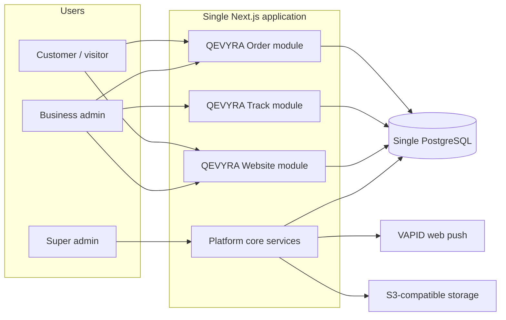
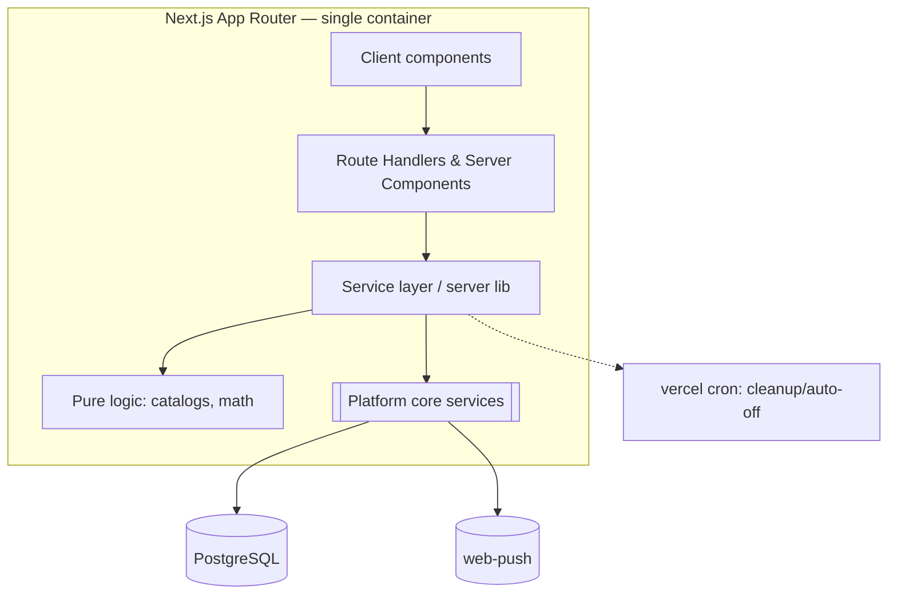

# QEVYRA — Target Architecture

> The plan for where QEVYRA goes. Stage 0 does **not** implement this — it defines it. Current live system is described in `CURRENT_SYSTEM_AUDIT.md`.

---

## 1. Product vision

QEVYRA is a **multi-business digital platform**. Each business (restaurant, hotel, homestay, retail, service) gets a digital presence and digital operations through **optional, combinable products** sharing one platform, one tenant model, one database, and one codebase.

Product lines (current scope):

| Product | Today | Target | Tenant touchpoint |
| --- | --- | --- | --- |
| **QEVYRA Order** | `modules/order/menu-saas` (live) | QR menu + ordering + bookings + billing | Restaurant / hotel F&B |
| **QEVYRA Track** | placeholder | Place/venue digital seat & equipment use (timer-based, push) | Rooms, pools, tables, multi-venue sites |
| **QEVYRA Website** | placeholder | On-platform business website with QR + discovery | Any business |

Future (design only, not implemented): WhatsApp ordering/notifications, cross-platform customer network, loyalty/CRM, payments.

### Foundations that never change

1. **One monorepo, one app, one database.** No microservices, no per-industry database.
2. **`Business` is the universal tenant.** Not "restaurant" — a superset that covers every vertical (restaurant, hotel, homestay, retail, …). Tenant isolation is **mandatory** in every query.
3. **Modules are vertical slices, not system boundaries.** A module owns its features AND its data tables. Modules never read each other's tables — they use the platform service layer.
4. **Working product is king.** Makeable steps, every change verifiable, never a broken deploy.
5. **Plans are capabilities, not products.** BRONZE/SILVER/STAR generalize into a capability catalog from which every product draws feature keys.

---

## 2. High-level context



Non-negotiable: **all module data lives in the same Postgres**, partitioned by `businessId` (tenancy). Push/storage are platform services via the platform core.

---

## 3. Platform core services (shared, evolved from today)

| Service | Origin today | Future responsibility |
| --- | --- | --- |
| `core/tenancy` | `Restaurant`-scoped queries | `Business` + tenant guard on every DB access; `loadOperationalBusiness()` |
| `core/auth` | `src/lib/auth.ts`, `proxy.ts`, `auth-guard.ts` | Roles; business-scoped sessions; customer tokens; central API guards |
| `core/plans` | `plan-catalog.ts` + `plans.ts` | Capability catalog; feature/limit keys per business; auto-off |
| `core/settings` | PlatformSetting | Business-level + platform-level config |
| `core/notifications` | notifications + push | In-app inbox + web-push; extends to Track |
| `core/activity` | AdminActivity | `PlatformLog` audit for all platform mutations |
| `core/i18n` | `i18n.ts` + `use-customer-lang` | Locale catalog (EN/NEP + more) per business |
| `core/realtime` | polling + `router.refresh()` | SSE/WS channel service for Track/kitchen (deferred) |
| `core/billing` | table-bill math only | Payments gateway (deferred) |
| `core/media` | — new | File upload metadata + signed storage (deferred) |

Modules (Order/Track/Website) may **only** depend on the platform core — never on each other's internals.

---

## 4. Module layout (target, within the single app)

```
src/modules/
├── order/          # today: everything under src/app + src/lib (stays put in menu-saas tree)
│
├── track/          # new: place/venue digital timer usage
│   ├── schema.ts   # Track tables (TrackUnit, TrackSession, ...)
│   ├── server/     # track services (authoritative, tenant-scoped)
│   └── ...
│
├── website/        # new: business website + QR pages
│   └── ...
│
└── platform/       # shared core from §3 (cross-module)
```

Reality check for Stage 0–1: **Order keeps its current structure inside `modules/order/menu-saas`**. The modular "src/modules" shape is created incrementally — first as `platform/` core extracted from order's `src/lib`, then new modules join. Order is migrated toward it in later stages without a rewrite.

---

## 5. Container view (server services inside the app)



Rules: business logic lives in the service layer (server), never in components. Pure math/catalogs stay pure and unit-testable. API routes stay thin (validate → call service → respond).

---

## 6. Tenancy: the `Business` model (evolution, not rewrite)

Transition path (later stage, additive only):

1. Add `Business` table. Every existing `Restaurant` row gets `businessId` via migration (1 restaurant = 1 business). The `Restaurant` row becomes the *Order profile* of a business.
2. Tenant columns on Order tables stay as `restaurantId` during transition (no data churn); new tables (Track/Website) are created with `businessId` directly.
3. A `TenantLink`/computed tenant guard resolves `businessId` for Order reads; finally, a later stage renames `restaurantId → businessId` coherently with the capability refactor.

Isolation guarantees (target):

- Every DB access from module code goes through a tenant-scoped service that **requires** the `businessId` of the acting session.
- Customer/anonymous reads are allowed only through stable, unguessable public handles (slug + qrToken equivalents) and each public endpoint re-validates ownership inside a transaction.
- Cross-business access is architecturally prevented (service enforces scope), not just by convention.

---

## 7. Capabilities & plans (generalization)

| Today | Target |
| --- | --- |
| `Plan` keyed BRONZE/SILVER/STAR; STAR = `ALL_CURRENT_FEATURES` | `Plan` keyed by catalog; every feature has a stable key |
| Feature keys shared with limits | `FEATURE_CATALOG` grouped per product (order.*, track.*, website.*) |
| `featureOverrides`/`limitOverrides` JSON on Restaurant | Same, moved onto `Business` |
| GOLD unimplemented | Capability-based access: a business gets features by plan OR overrides OR grants — no hard-coded "gold" reserved |

Design rule: **features are additive and flag-driven**. A business on track.* + order.* features simply has both products. No product "owns" the storage layer.

---

## 8. Realtime & Track implications

- Order today: **3s polling + refresh**. Acceptable now; frozen.
- Track needs **push-grade** updates (timer started/stopped, usage end alerts). Policy: introduce one **platform realtime channel** (`core/realtime`, SSE first for owner panels, WS later for customer panels) once Track lands — do NOT bolt per-product polling clones.
- All current VAPID push infra is reused for Track and WhatsApp-notification journeys later.

---

## 9. Deployment & infra (target stays simple)

- One Vercel app (existing pipeline, `vercel.json`, `prepare-db.mjs` preserved).
- One managed Postgres (Supabase today). Schema anchored by Prisma migrations; `db push` never used against production.
- `vercel.json` cron: retained for order-history cleanup and lazy auto-off remains cron-free.
- Media: object storage deferred (`core/media`); today images are external URLs — keep.
- No Docker changes now: `docker-compose.yml` remains the local dev DB only.

---

## 10. Module dependency rules (the architecture rules core)

1. Feature module → platform core only. Never module→module.
2. Pure logic (math/catalogs): no imports of server-only code, no `prisma`.
3. API routes are thin: agency guard → Zod validate → service call → response.
4. All cross-module reads via `platform` service functions using the active tenant guard.
5. New tables always carry the tenant FK (initially `businessId`, transitional `restaurantId` documented in `DATABASE_EVOLUTION.md`).

---

## 11. Evolution milestones (summary of QEVYRA_ROADMAP.md)

| Stage | Deliverable |
| --- | --- |
| 0 | Foundation docs + repo structure + placeholders (**this stage**) |
| 1 | Order hardening: centralized guards, split `src/lib/db.ts`, tests, brand constants |
| 2 | `Business` tenancy model migration + platform core extraction |
| 3 | QEVYRA Track v1 (places, timer units, sessions, push) |
| 4 | QEVYRA Website v1 (public site + QR landing) |
| 5+ | Payments, WhatsApp ordering, customer network, realtime upgrade |

Every stage must leave the deployed product working. Detailed plan in `QEVYRA_ROADMAP.md`.

---

## 12. Non-goals (explicit)

- No microservices, no serverless function-per-module split.
- No per-industry database or schema fork.
- No OAuth provider login yet.
- No online payment integration yet.
- No module→module coupling, ever.
- No rewrite of the working Order product "in spirit of refactoring".

---